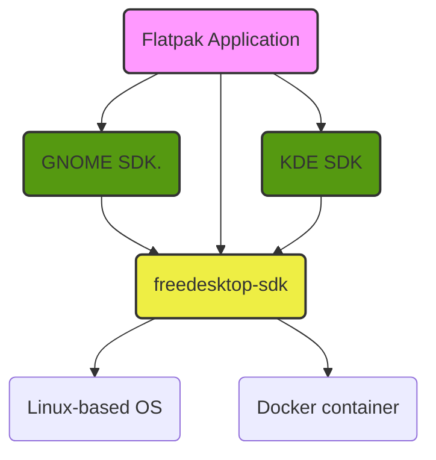

# Freedesktop SDK

The Freedesktop SDK project provides Platform and SDK runtimes for
[Flatpak](https://flatpak.org) apps and runtimes based on Freedesktop modules.
It was originally started as a [Flatpak subproject](https://github.com/flatpak/freedesktop-sdk-images)
to create a basic-neutral runtime. It is now a separate project, similar to
what happened with the GNOME and KDE runtimes.

As explained in [Alex's blog post](https://blogs.gnome.org/alexl/2018/05/16/introducing-1-8-freedesktop-runtime/)
there has long been a desire to upgrade and modernize the SDK, which is where
this specific project comes into the story.

This is a diagram of how the Freedeskop SDK runtimes interact with the rest of
the Flatpak ecosystem:



Our goals, some of which are already achieved:

*   Improve maintainability, using a single metadata format instead of several
    different ones. We use [BuildStream](https://gitlab.com/BuildStream/buildstream)
    for this.
*   Support multiple architectures out of the box. (armv7, aarch64, i386, and x86_64)
*   Long term maintenance of the SDK, with improved automation to do so,
    including tests for ABI stability.
*   Define formal release cycles.
*   Host on official freedesktop.org infrastructure.
*   Add minimal bootable system and generic sysroot.
*   Maintain a neutral baseline which can be consumed by Flatpak, GNOME, KDE
    and any other interested project.


## Usage

Currently the Freedesktop SDK is meant to be used as the base for all Flatpak
applications.

We recommend you install releases from [Flathub](https://flathub.org).

The current set of commands to run your application with 18.08 are:

1.  Install the new runtimes:

    ```
    $ flatpak remote-add --if-not-exists flathub https://flathub.org/repo/flathub.flatpakrepo
    $ flatpak install --user freedesktop-sdk runtime/org.freedesktop.Sdk//18.08
    $ flatpak install --user freedesktop-sdk runtime/org.freedesktop.Platform//18.08
    ```

2.  Set your app manifest:

    ```
    "runtime-version": "18.08"
    ```

3. Build and run your flatpak app as usual:

    ```
    $ flatpak-builder build_folder org.app.json
    $ flatpak-builder --run build_folder org.app.json
    ```


### Building the runtimes locally

If you wish to build locally, you must install:

 * [BuildStream](https://gitlab.com/BuildStream/buildstream)
 * [Flatpak](https://flatpak.org/setup/)
 * Flatpak Builder

You can clone the Git repository and then simply run:

```
$ make build
```

Note that `build` is the default target, so the following is equivalent:

```
$ make
```

If you wish to build for a different architecture than the one of your system,
specify the `ARCH` variable:

```
$ make ARCH=aarch64 build
```

The build is configured to pull from our remote artifact cache, so you should
not have to actually compile anything, unless you made any local change.


### Exporting your local builds

If you want to try using your own local build of the runtimes, you can export
your builds to a repository:

```
$ make export
```

This will build everything, then checkout the built trees, and commit them to
a local Flatpak repository.

To save some time, you can build only the few parts you want to test:

```
$ make RUNTIMES="platform sdk" export
```

Here again, you can build for a foreign architecture by specifying the `ARCH`
variable.

Once this finishes, you will find a Flatpak repository in the `repo` folder.

To then use the generated runtimes you can run:

```
$ flatpak remote-add --if-not-exists --user --no-gpg-verify test-repo repo/
$ flatpak install --arch="${ARCH}" --user test-repo org.freedesktop.Sdk//18.08
$ flatpak install --arch="${ARCH}" --user test-repo org.freedesktop.Platform//18.08
```

At this point you can build and run your application against your build of the
Freedesktop SDK.


## Structure

Current directory structure is the usual of a builstream project with the
exception of the `bootstrap/` folder which contains a buildstream subproject
with a set of instructions to bootstrap a minimal sysroot, used to build all
the Flatpak runtimes defined in the `elements/` folder.

The `plugins/` directory contains our custom Buildstream
[plugins](https://buildstream.gitlab.io/buildstream/pluginindex.html#plugins)


## Contributing

If you would like to contribute or suggest any improvements to the Freedesktop
SDK, please submit a merge request.

We have a CI which automatically tests merge requests across all supported
architectures, please ask a developer for access.

Here is a lovely article on how to ideally structure a git commit message:
https://chris.beams.io/posts/git-commit/#seven-rules/

If you would like to ask any question on how to use/improve this project, you
will find us over at #freedesktop-sdk on Freenode, and on our mailing list:
https://lists.freedesktop.org/mailman/listinfo/freedesktop-sdk
