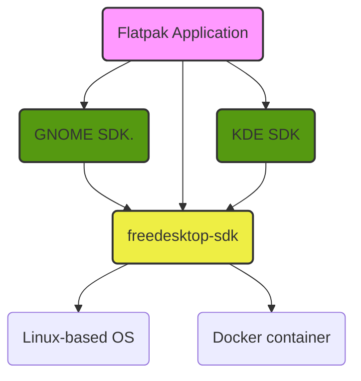

# Freedesktop SDK

The Freedesktop SDK project provides Platform and SDK runtimes for
[Flatpak](https://flatpak.org) apps and runtimes based on Freedesktop modules.
It was originally started as a [Flatpak subproject](https://github.com/flatpak/freedesktop-sdk-images)
to create a basic-neutral runtime. It is now a separate project, similar to
what happened with the GNOME and KDE runtimes.

As explained in [Alex's blog post](https://blogs.gnome.org/alexl/2018/05/16/introducing-1-8-freedesktop-runtime/)
there has long been a desire to upgrade and modernize the SDK, which is where
this specific project comes into the story.

This is a diagram of how the Freedeskop SDK runtimes interact with the rest of
the Flatpak ecosystem:



Our goals, some of which are already achieved:

*   Improve maintainability, using a single metadata format instead of several
    different ones. We use [BuildStream](https://gitlab.com/BuildStream/buildstream)
    for this.
*   Support multiple architectures out of the box. (armv7, aarch64, i386, and x86_64)
*   Long term maintenance of the SDK, with improved automation to do so,
    including tests for ABI stability.
*   Define formal release cycles.
*   Host on official freedesktop.org infrastructure.
*   Add minimal bootable system and generic sysroot.
*   Maintain a neutral baseline which can be consumed by Flatpak, GNOME, KDE
    and any other interested project.


## Usage

Currently the Freedesktop SDK is meant to be used as the base for all Flatpak
applications.

We recommend you install releases from [Flathub](https://flathub.org).

The current set of commands to run your application with 18.08 are:

1.  Install the new runtimes:

    ```
    $ flatpak remote-add --if-not-exists flathub https://flathub.org/repo/flathub.flatpakrepo
    $ flatpak install --user freedesktop-sdk runtime/org.freedesktop.Sdk//18.08
    $ flatpak install --user freedesktop-sdk runtime/org.freedesktop.Platform//18.08
    ```

2.  Set your app manifest:

    ```
    "runtime-version": "18.08"
    ```

3. Build and run your flatpak app as usual:

    ```
    $ flatpak-builder build_folder org.app.json
    $ flatpak-builder --run build_folder org.app.json
    ```

## Available Runtimes

Currently we provide the following runtimes:
* org.freedesktop.Platform
* org.freedesktop.Sdk

Additionally we provide the following extensions to our platform:
* org.freedesktop.Platform.Locale
* org.freedesktop.Platform.VAAPI.Intel (Intel only)
* org.freedesktop.Platform.html5-codecs
* org.freedesktop.Platform.Compat.{architecture}

And the following extensions to the SDK:
* org.freedesktop.Sdk.Locale
* org.freedesktop.Sdk.Docs
* org.freedesktop.Sdk.Debug
* org.freedesktop.Sdk.Extension.rust-stable

We also provide org.freedesktop.GlxInfo and org.freedesktop.GlxInfo.Debug as flatpak applications.

## Structure

Current directory structure is the usual of a builstream project with the
exception of the `bootstrap/` folder which contains a buildstream subproject
with a set of instructions to bootstrap a minimal sysroot, used to build all
the Flatpak runtimes defined in the `elements/` folder.

The `plugins/` directory contains our custom Buildstream
[plugins](https://buildstream.gitlab.io/buildstream/pluginindex.html#plugins)


## Contributing

For a guide to contributing, please see our CONTRIBUTING file.

## Acknowledgements

This project wouldn't be possible without the work of a few individuals and
groups, and we would like to take a moment to thank them.

*   Alex Larsson, who not only gave us [Flatpak](https://flatpak.org) but also
    the original
    [Freedesktop Sdk](https://github.com/flatpak/freedesktop-sdk-images)
    (versions 1.2 to 1.6);
*   the wider Flatpak community, of which we are only a small part, and who
    constantly help us;
*   the [BuildStream](https://buildstream.build/) community, who offered this
    amazing tool to the world which makes building and maintaining our project
    so easy and fun;
*   Dodji Seketeli who wrote [libabigail](https://sourceware.org/libabigail/),
    which allows us to ensure we do not break apps, and tirelessly works with
    us on fixing any bug we encounter;
*   [Codethink](https://www.codethink.co.uk/), for assigning some of their
    engineers's time to this project;
