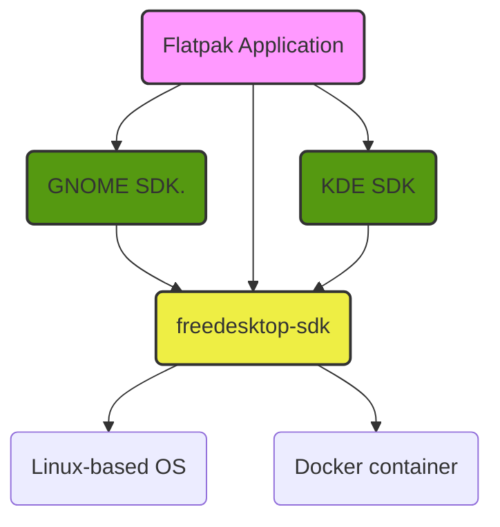

# freedesktop-sdk

**Some context...**

The freedesktop-sdk is a project that provides Platform and SDK runtimes for [flatpak](https://flatpak.org) apps and runtimes based on freedesktop modules. It was originally started as a [Flatpak subproject](https://github.com/flatpak/freedesktop-sdk-images) to create a basic-neutral runtime. It's now a separate project, similar to what is happening with the GNOME runtime and the KDE one.

As explained in Alex's [blog post](https://blogs.gnome.org/alexl/2018/05/16/introducing-1-8-freedesktop-runtime/) there has long been a desire to upgrade and modernize the sdk, which is where this specific project comes into the story...

This is a diagram of how freedeskop-sdk flatpak runtime interact with the rest of the flatpak ecosystem:


Our goals:
* Improve maintainability, using a single metadata format instead several different ones. We use [BuildStream](https://gitlab.com/BuildStream/buildstream) for this.
* Suport multiple architectures out of the box ( armv7, aarch64, x86, and x86_64).
* Long term maintenance of the SDK, with improved automation to do so, including tests for ABI stability.
* Define formal release cycles.
* Host on official freedesktop.org infrastructure (ie. migrate from gitlab.com to gitlab.freedesktop.org)
* Add minimal bootable system and generic sysroot.
* Maintain a neutral baseline which can be consumed by Flatpak, GNOME, KDE and any other interested project.


# Usage

Currently the freedesktop-sdk is meant to be used as the base for all Flatpak applications.

So you simply need to point your Flatpak build to our release server http://cache.sdk.freedesktop.org/releases/.

Located here you should find releases built for multiple architectures (aarch64, i586, x86_64).

The current set of commands to run your application with 18.08 are:

Install the new runtime from remote:
```
  flatpak remote-add --if-not-exists --user freedesktop-sdk https://cache.sdk.freedesktop.org/freedesktop-sdk.flatpakrepo
  flatpak install --user freedesktop-sdk runtime/org.freedesktop.Sdk//18.08
  flatpak install --user freedesktop-sdk runtime/org.freedesktop.Platform//18.08
```
Once this has been installed, you then need to change the:

```
  "runtime-version": 1.6
```
To

```
  "runtime-version": 18.08
```

Build and run your flatpak app as normal:
```
  flatpak-builder build_folder org.app.json
  flatpak-builder --run build_folder org.app.json
```


## Building the runtime locally

If you wish to build locally, you must have BuildStream installed and a local instance of [libostree](https://ostree.readthedocs.io/) on your machine.

```
- cd "${CI_PROJECT_DIR}"/sdk
    - ${BST} -o target_arch "${ARCH}" build all.bst

    - echo "Export runtimes to a ostree repo"
    - mkdir runtimes
    - |
      for runtime in sdk platform; do
        bst -o target_arch "${ARCH}" checkout "${runtime}.bst" "runtimes/${runtime}";
      done
    - cd ${CI_PROJECT_DIR}

    - echo "Use flatpak builder to export the runtimes to a ostree repo"
    - dnf install -y flatpak flatpak-builder
    - export FLATPAK_USER_DIR="${PWD}/tmp-flatpak"
    - flatpakarch="${ARCH/i586/i386}"
    - flatpak build-export --arch=${ARCH} --files=files repo/ sdk/runtimes/sdk 18.08;
    - flatpak build-export --arch=${ARCH} --files=files repo/ sdk/runtimes/platform 18.08;

    - echo "Locally install generated flatpak runtimes"
    - flatpak remote-add --if-not-exists --user --no-gpg-verify test-repo repo/
    - flatpak install --arch="${flatpakarch}" --user test-repo runtime/org.freedesktop.Sdk//18.08
    - flatpak install --arch="${flatpakarch}" --user test-repo runtime/org.freedesktop.Platform//18.08

    - echo "Build basic flatpak app"
    - flatpak-builder --arch="${flatpakarch}" build_folder tests/org.flatpak.Hello.json

    - echo "Run basic application"
    - flatpak-builder --arch="${flatpakarch}" --run build_folder tests/org.flatpak.Hello.json hello.sh
```

The build is configured to pull from our remote artifact cache, meaning you should not have to build
anything locally, only if buildstream detects any custom changes/additions locally will you have to
rebuild, and even then buildstream is smart enough to figure out what actually *needs* to be re-built
instead of re-building everything.


These instructions for building can be found in the projects Gitlab-CI file.


# Structure
Current directory structure is the usual of a builstream project with the exception of:

 - bootstrap

The bootstrap folder includes a buildstream subproject with a set of instructions to bootstrap a minimal sysroot,
used to build all the freedesktop flatpak runtimes defined in the elements folder.

The plugins directory, is a custom directory needed to host our custom Buildstream [plugins](https://buildstream.gitlab.io/buildstream/pluginindex.html#plugins)

# Contributing

Finally if you would like to contribute or suggest any improvements to the bootstrap/SDK, please submit an MR.

In the future we are going to configure the CI to allow users to push/test their fixes/improvements automatically across all supported platforms.

Here's a lovely article on how to ideally structure a git commit message - https://chris.beams.io/posts/git-commit/#seven-rules/ 

If you would like to ask any questions on how to use/improve this project, you will find us over at #freedesktop-sdk on Freenode, and we have a mailing list https://lists.freedesktop.org/mailman/listinfo/freedesktop-sdk.
